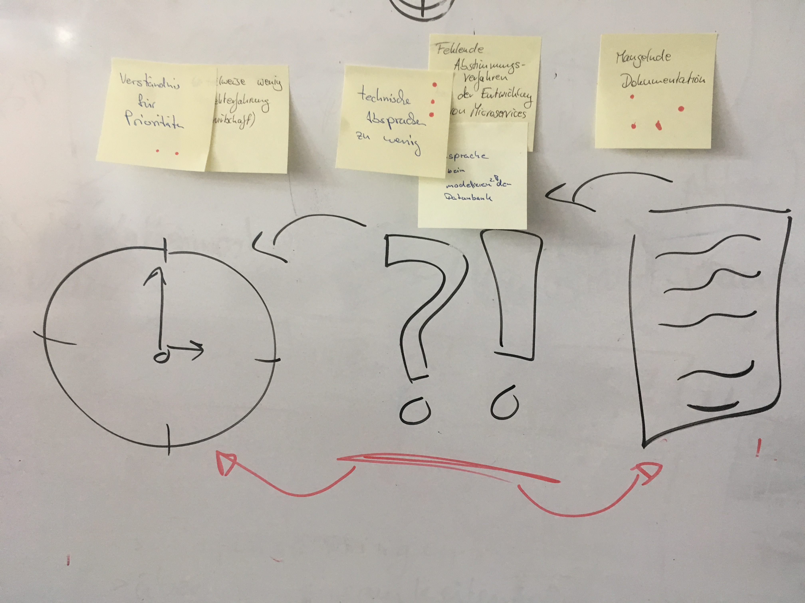

# Retrospektive 

Das Projektteam hat sich dazu entschieden, in einem Abstand von zwei Monaten eine Retrospektive [[1]] durchzuführen.

## Dokumentation

Durch eine Übersicht der vergangenen Retrospektiven soll neuen Beteiligten die Möglichkeit erschaffen werden, Entwicklungen und Entscheidung innerhalb des Teams besser nachvollziehen zu können. Die Entwicklung des Teams ist ein iterativer Prozess, welcher durch die Retrospektive einer stetigen Reflexion unterstellt ist. 

### 18.06.2018

### Aktuellen Themen

* Positiv
  * Es findet viel Austausch im Team statt, welcher wertgeschätzt wird:
    * Gemeinsames Homeoffice
    * Austausch in Pausen und auf Wegen 
    * Pair Programming
  * Allgemeine Programmiererfahrung
  * Die Stimmung und Motivation innerhalb des Teams ist positiv:
    * Positiver Umgang miteinander
    * Aufgeschlossenheit für technische Probleme
    * Innovative Denkmuster
* Neutral
  * Commitment
  * NPM Vielfalt
  * klare Aufgabenteilung
* Negativ
  * Technische Abhängigkeiten bzw. Probleme
    * Fehlersuche nimmt oft viel Zeit in Anspruch
    * Fehlende Erfahrung bei der Entwicklung von Microservices
    * Fehlende Erfahrung bzw. Probleme mit Scala
  * Alleine Homeoffice
  * **Unterschiedliches Verständnis für Prioritäten**
  * **Zu wenig technische Absprachen**
  * **Mangelnde Dokumentation**

Das Team sieht die drei markierten Punkte, als die aktuellen zentralen Probleme innerhalb des Teams an. Durch einem Austausch über das Verständnis zu den drei Punkten, wurde deutlich, dass die drei Punkte starke Seiteneffekte aufeinander haben bzw. Folgen oder Ursachen füreinander sind. 

Zusammenfassend kann gesagt werden:

1. Technische Absprachen müssen bewusster getroffen werden. Hierbei ist es wichtig, dass Entscheidungen auf einem Konsens beruhen und nicht erzwungen werden. Wichtig für die Findung von Entscheidungen ist ein gleiches Verständnis über Sachverhalte, dieses muss zunächst immer geprüft werden. 
2. Durch bessere Absprachen ist eine bessere Dokumentation möglich. Zum einen da ein bessere Verständnis über die entsprechenden Themen vorliegt, zum anderen, da auch die Abstimmung dokumentiert werden soll. Hier durch wird mehr auf die Fragen "Wie" und "Warum" mehr eingegangen und nicht nur auf die Aspekte was gemacht wurde bzw. was möglich ist.
3. Durch die besseren Absprachen sollen Entwicklungsprozesse besser messbar und abschätzbar werden. Dies sollte sich positiv auf das Projektmanagement auswirken, da eine bessere bzw. zuverlässigere Planung möglich ist.

#### Smart Goals

Auf Basis der aktuellen Themen ergeben sich die folgenden Smart Goals:

1. Weekly soll bessere strukturiert (FG)
2. Dokumentation von Entscheidungen (Einführung von Epic Issues) (JO)

*Die Team-Mitglieder FG und JO erarbeiten für die Smart Goals ein Konzept*.

## Quellen:

* [[1]][Retrospektiven (letzter Zugriff: 18.06.2018)](https://www.it-agile.de/wissen/praktiken/retrospektiven/)
